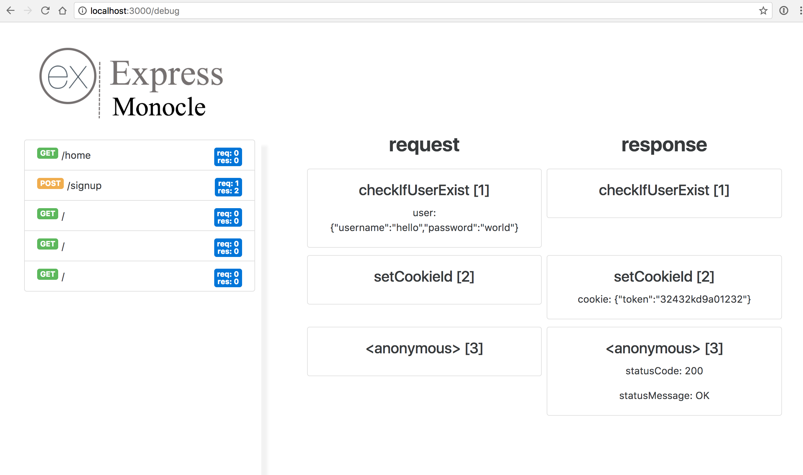

# Express Monocle
### *A developer tool for debugging your server-side routes*

## Description 
Express Monocle forks the popular Node server library, express, and adds easy-to-use degugging functionality for developers.  You can track the changes to the request and response objects as they make their way through server routes in order to easily find out how and when the objects change.

We inject ES6 proxies into the request and response object constructors to easily track changes.

We also implemented an automatic debugging route to visualize those changes called '/debug' to see exactly what's going on.

## Installation

```bash
$ npm install express-monocle
```

## Usage

```js
const em = require('express-monocle');
const path = require('path');
const bodyParser = require('body-parser');

const app = em();

app.use(bodyParser.urlencoded({ extended: false }));
app.use(bodyParser.json());

app.get('/', function (req, res, next) {
  res.sendFile(path.join(__dirname, 'index.html'));
});

app.post('/signup', function checkIfUserExist(req, res, next) {
  req.user = {
    username: 'hello',
    password: 'world'
  };
  next();
}, function setCookieId(req, res, next) {
  res.cookie = { token: '32432kd9a01232' };
  next();
}, function (req, res, next) {
  res.redirect('/home');
});

app.get('/home', function (req, res) {
  res.sendFile(path.join(__dirname, 'home.html'));
});

app.listen(3000);
```

**Screenshot of debugging route:**
  

## <a name="authors"></a>Authors  
[Cheng Ly](https://github.com/chengsieuly)  
[Travis Huff](https://github.com/travishuff)  
[Patrick Divine](https://github.com/pddivine)  
[Sahil Nayak](https://github.com/sahilnayak)

Access your routes and then go to `/debug` to see all the changes.

## License

MIT