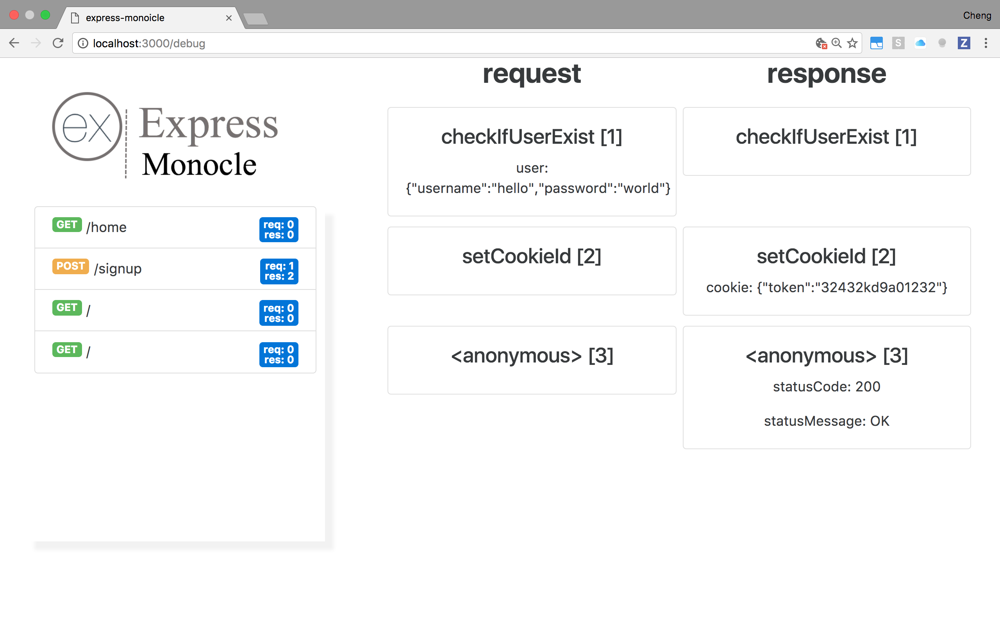

Development server built on top of Express to track changes in the request and response objects.

## Installation

```bash
$ npm install express-monocle
```

## Usage

```js
const em = require('express-monocle');
const path = require('path');
const bodyParser = require('body-parser');

const app = em();

app.use(bodyParser.urlencoded({ extended: false }));
app.use(bodyParser.json());

app.get('/', function (req, res, next) {
  res.sendFile(path.join(__dirname, 'index.html'));
});

app.post('/signup', function checkIfUserExist(req, res, next) {
  req.user = {
    username: 'hello',
    password: 'world'
  };
  next();
}, function setCookieId(req, res, next) {
  res.cookie = { token: '32432kd9a01232' };
  next();
}, function (req, res, next) {
  res.redirect('/home');
});

app.get('/home', function (req, res) {
  res.sendFile(path.join(__dirname, 'home.html'));
});

app.listen(3000);
```

Access your routes and then go to `/debug` to see all the changes.

## License

MIT